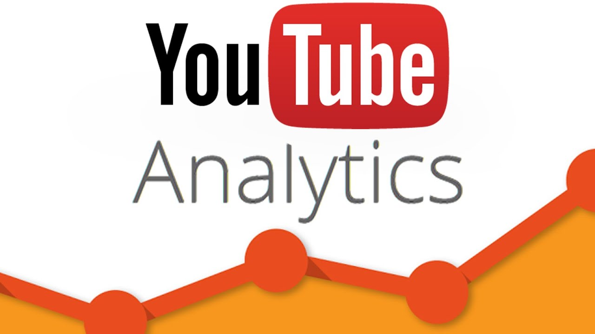

# YouTube_Campaign

## Introduction
### Purpose: For all company marketing department who wants to run an their company ad- campaign on Youtube.

## Marketing Platform: Youtube

### Business Questions: How to categorise videos, based on their comments and statistics
### What factors affect and answers the question: How Popular a Youtube video will be? 

### Why Youtube? 
### Most visited platform in the world, to be precise 2nd most visited.
### So easy to target more people in short span of time, thus we can get more customers

## Goals and Success Criteria: 
### How my customer measure success?
The establishment of efficient mechanisms for data ingestion from diverse sources, implementing an Extract, Transform, Load (ETL) system to convert raw data into the appropriate format, and creating a centralized data lake for storage. And the Marketing Team will have better insights on Viewers interactions and which category has large audience. This will help them to better strategize for better youtube campaigns. 

### What Experience I gained:
1.	Building Data Lake from scratch using Amazon S3
2.	Lake House Architecture design
3.	Data Lake vs Data Warehouse
4.	Data Lake Design and how its partition affects cost- performance
5.	AWS Data Catalogue
6.	ETL Jobs using AWS Glue Spark
7.	Amazon SNS for altering
8.	SQL using Amazon Athena and Spark SQL
9.	Script to ingest changes incrementally and schema evolution.
10.	BI Dashboards in Amazon QuickSight.

